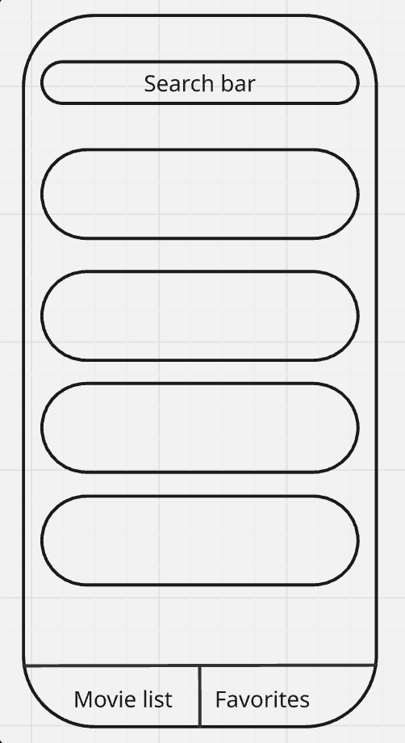
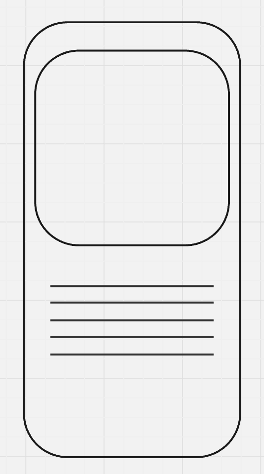
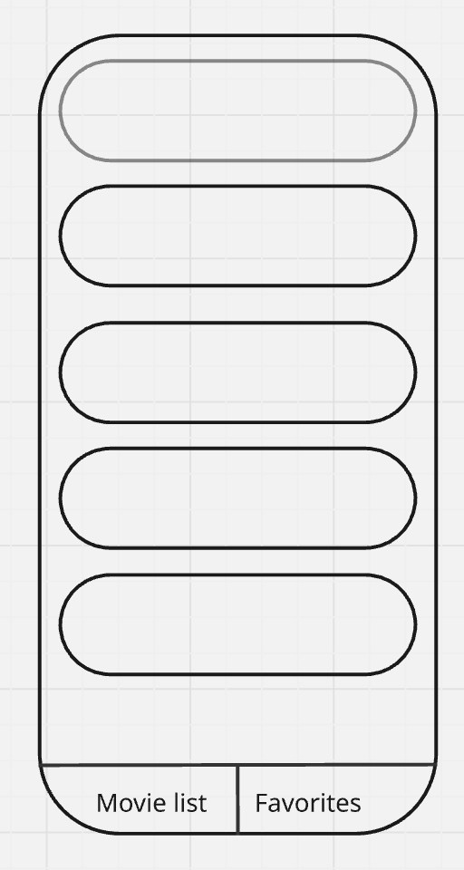
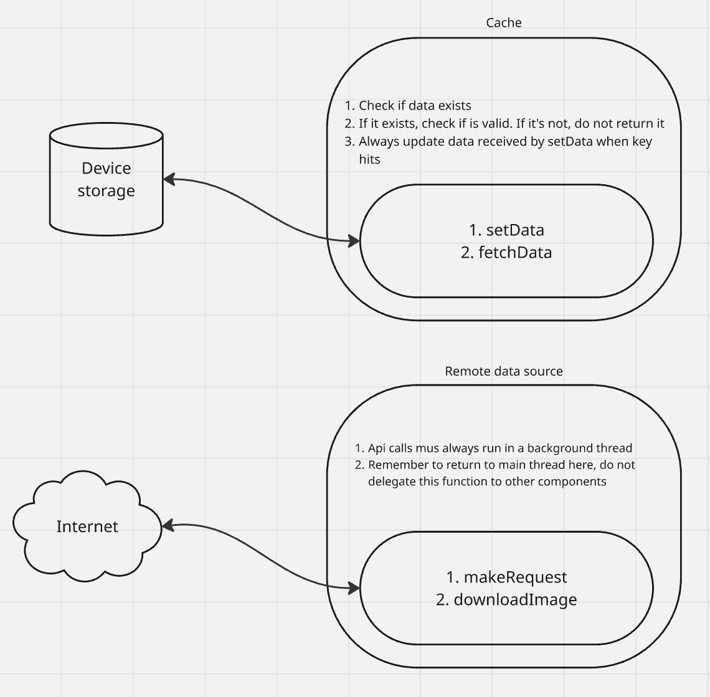
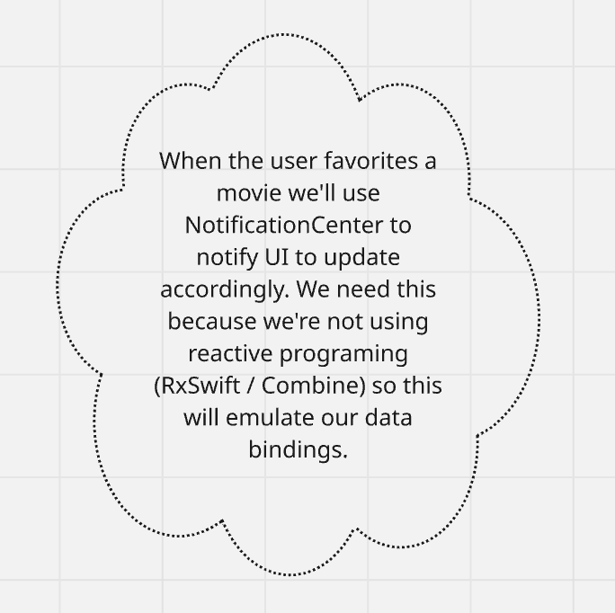
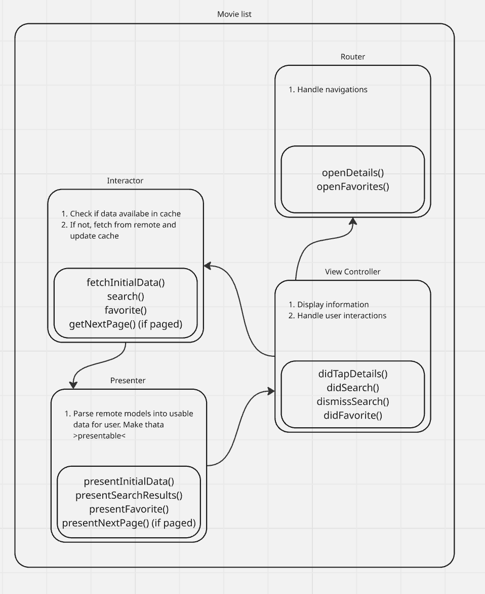
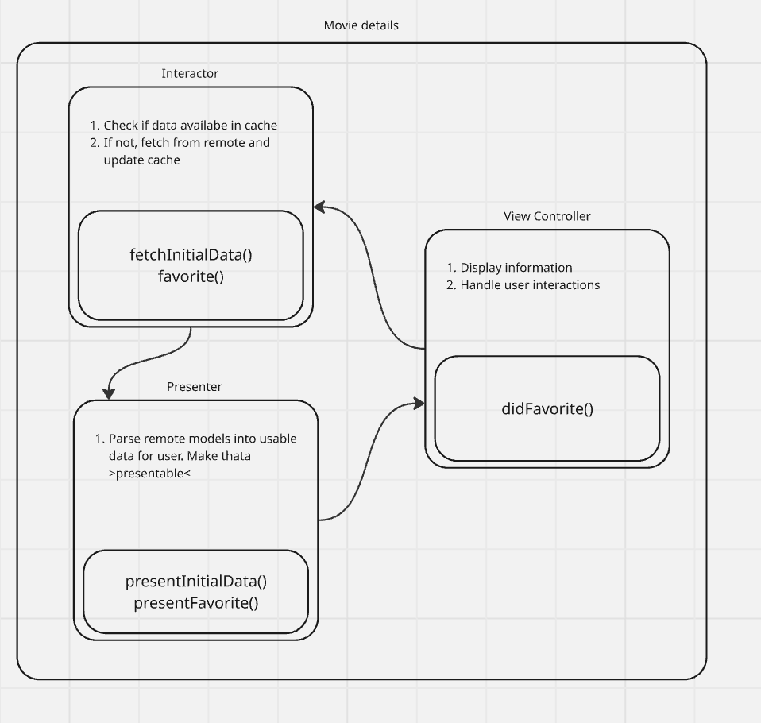
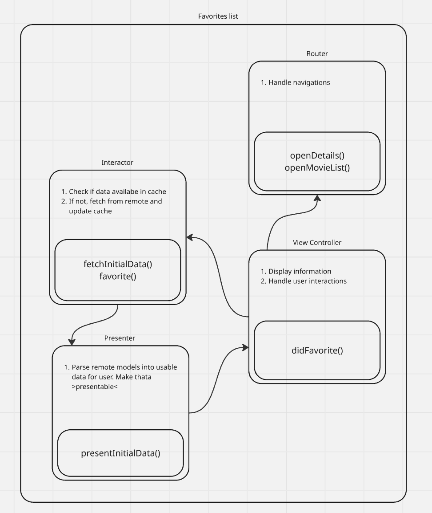

# MoviesSampleApp

## Dependencies
This projects uses [Xcodegen](https://github.com/yonaskolb/XcodeGen), [Fastlane](https://fastlane.tools/) and [Bundler](https://bundler.io/) to minimize your time setting up everything! It also has [Swiftlint](https://realm.github.io/SwiftLint/) to ensure code coding style and conventions.

Please use `Xcode 16` to run this.

### Why those?
[Xcodegen](https://github.com/yonaskolb/XcodeGen) is a good choice when wroking in big repos because it removes the need for pushing `.xcodeproj` and `.xcworkspace` to remote. This is possible thanks to the way it works, we provide a configuration file (`project.yml`) that is used to generate `.xcodeproj` files on the fly!
There are other alternatives too, one that work particulary well with SPM is called [Tuist](https://tuist.dev/)

[Fastlane](https://fastlane.tools/) is just awesome, it's a really powerful tool that allow creating `lanes` for each job your pipeline might need. If you see my other [test repo](https://github.com/EdYuTo/iOSProjectSetup) you'll see that i did basically the same github actions configurations as here, but using `Makefile`. You'll also see that it was necessary a couple of extra scripts to achieve what was possible with just one file with `Fastlane`.

[Bundler](https://bundler.io/) was used to ensure all machines run under the same dependencies. It's super annoying when the code `works on my machine`, but you can't get it to run on someone else's. In theory, if we all run with the same conditions, the project should work just fine for everybody!

In the same line as `Bundler`, other awesome tools that we could use are [Xcodes](https://www.xcodes.app/) for managing xcode versions and [rbenv](https://rbenv.org/) to manage different ruby versions (specially for our fastlane gems!).

[Swiftlint](https://realm.github.io/SwiftLint/) is used to ensure a codebase consistency and clarity.

## Setup

Although this is not required, it is recommended to use [rbenv](https://rbenv.org/) to manage your ruby environment:

```bash
brew install rbenv
```

```bash
rbenv install 3.2.0
```

```bash
rbenv local 3.2.0
```

First install any missing dependencies with:
```bash
bundle install
```

Then run fastlane to create the project:
```bash
bundle exec fastlane generate_project
```

## Architecture
You can find the design document for the app in [Miro here](https://miro.com/app/board/uXjVI0R3_jU=/).

### Screens
But overall we're aiming for 3 screens:
* One for listing the movies

<div align="center">
    
</div>

* One for showing the details for that movie

<div align="center">
    
</div>

* One for listing saved / favorited movies

<div align="center">
    
</div>

### Components
You'll notice that I'm structuring this project using `VIP` pattern. And, to be honest, this was more of a personal choice for the stack that we'll be using here. If we were to use `SwiftUI` and/or `reactive programming`, I'd definetely go for a `MVVM` pattern, since I belive it works pretty well with reactivity.

Excluding ui components, here is how this project will be sctructured:

#### Resource providers
<div align="center">
    
    
</div>

#### Movie list
<div align="center">
    
</div>

#### Movie details
<div align="center">
    
</div>

#### Favorite list
<div align="center">
    
</div>

---

As a side note, this design document was created before the actual implementation of the app (as it should be haha). So if there are any differences between both, something might had happened and it would be a good point for discussions on why the change.

## TBD
Add anything else here
